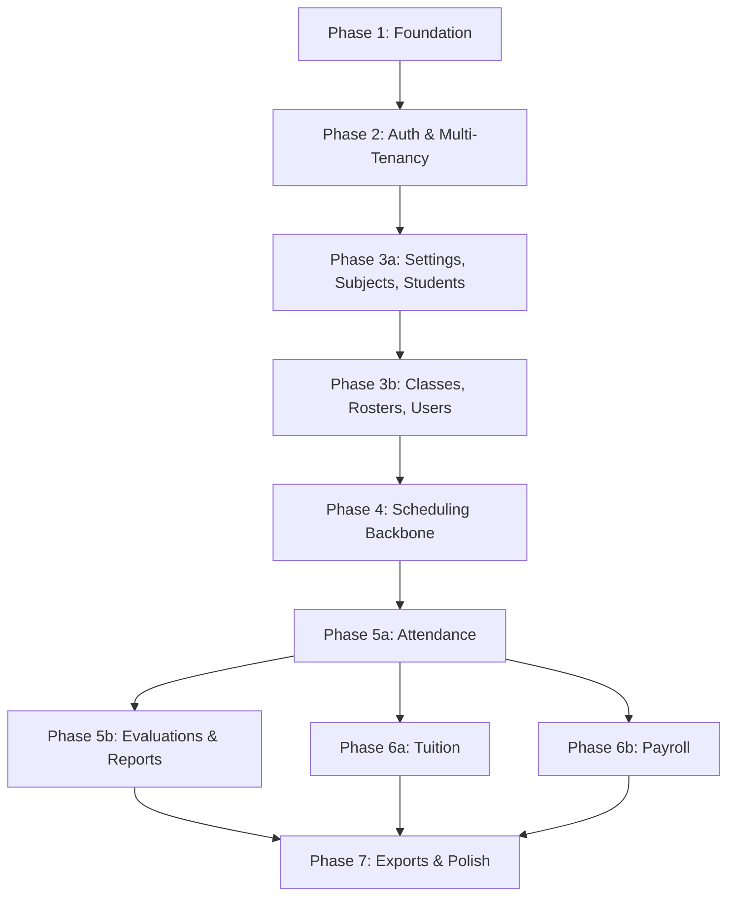

# EduCenter MVP — Implementation Roadmap & Plan (v2.0)

Fullstack Next.js monolith with Client-Side Rendering (CSR), Drizzle ORM, PostgreSQL (Supabase), TanStack Query, Zustand, and Tailwind CSS + shadcn/ui. Multi-tenancy enforced at application and database level via shared schema + `center_id` + Row Level Security.

---

## 🗺️ Roadmap Overview

10 phases, ordered by architectural dependency. Heavy phases are split into focused sub-phases.

---

## 📋 Phase-by-Phase Breakdown

### [Phase 1: Foundation](./Phase_1_Foundation/Plan.md)
*Est. 1–2 days. Establishes the complete project infrastructure — no subsequent phase revisits this layer.*

- [x] **1.0** Architecture decision — `features/` directory pattern documented
- [x] **1.1** Next.js tooling verification (`lang="vi"`, Tailwind tokens, path aliases)
- [x] **1.2** Install all runtime dependencies in one pass (Drizzle, TanStack Query, Zod, jose, bcryptjs, Zustand)
- [x] **1.3** shadcn/ui design system (correct CLI: `npx shadcn@latest`)
- [x] **1.4** Drizzle ORM + database client setup
- [x] **1.5** TanStack Query bootstrap (QueryClient singleton + `<Providers>` wrapper)
- [x] **1.6** Zustand stores bootstrap (3 stub files: auth, ui, attendance-form)
- [x] **1.7** Frontend API Manager (types, full route constants map, ApiError class, client with refresh lock)
- [x] **1.8** Environment variables (`.env.example` committed, `.env.development` gitignored)
- [x] **1.9** Stub error pages (`error.tsx`, `not-found.tsx`)

---

### [Phase 2: Authentication, Accounts & Multi-Tenancy Core](./Phase_2_Auth_And_Multi_Tenancy/Plan.md)
*Est. 2–3 days. JWT auth, role middleware, RLS, login UI.*

- [x] **2.2** Auth API: login (with rate limiting), refresh, logout, me
- [x] **2.3** Security middleware: `requireAuth`, `requireRole`, `requireCenter` + RLS policies
- [x] **2.4** Frontend: auth store (Zustand), login page, workspace layout guard

---

### [Phase 3a: Settings, Subjects & Students](./Phase_3_Core_Workspace_CRUD/Phase_3a_Settings_Subjects_Students.md)
*Est. 2–3 days. First center-scoped CRUD workflows.*

- [x] **3a.2** Center settings API (GET/PATCH)
- [x] **3a.3** Subjects API + service (soft-delete, uniqueness)
- [x] **3a.4** Students API + service (search, grade filter)
- [x] **3a.5** Frontend: settings page, subjects page, students page

---

### [Phase 3b: Classes, Rosters & Staff User Management](./Phase_3_Core_Workspace_CRUD/Phase_3b_Classes_Rosters_Users.md)
*Est. 2–3 days. Many-to-many roster with lifecycle + staff account management.*

- [x] **3b.2** Classes API + service (auto-name generation)
- [x] **3b.3** Roster API + service (re-enrollment creates new record)
- [x] **3b.4** Staff users API + service (bcrypt, self-deactivation guard, no super_admin)
- [x] **3b.5** Frontend: classes page, roster modal, staff users page

---

### [Phase 4: Scheduling & Lesson Operations](./Phase_4_Scheduling_Backbone/Plan.md)
*Est. 3–4 days. Shifts, schedules, sessions, bulk session generator.*

- [ ] **4.2** Shifts + schedules + sessions services (snapshotted times, time validation)
- [ ] **4.3** Bulk session generator (`POST /api/center/sessions/generate`, ≤90-day range, skip duplicates)
- [ ] **4.3** Frontend: shifts builder, weekly schedule planner, daily session register

---

### [Phase 5a: Session Attendance Marking](./Phase_5_Daily_Attendance_And_Evaluations/Phase_5a_Attendance.md)
*Est. 2–3 days. Mobile-first batch attendance + temporal gates.*

- [ ] **5a.2** Attendance service (batch upsert in transaction, temporal permission enforcement)
- [ ] **5a.3** `syncTeachingRecord` call stub wired into save path
- [ ] **5a.4** Frontend: mobile attendance checklist with status toggles and toast feedback

---

### [Phase 5b: Evaluations & Learning Reports](./Phase_5_Daily_Attendance_And_Evaluations/Phase_5b_Evaluations_And_Reports.md)
*Est. 2–3 days. Structured per-session evaluation + report compiler.*

- [ ] **5b.2** Evaluation service (creation constraint, approve/reject workflow)
- [ ] **5b.3** Learning report service (compiler from approved evaluations, status lifecycle)
- [ ] **5b.4** Frontend: evaluation entry form, review/approval list, report compiler page

---

### [Phase 6a: Tuition Configuration & Calculation](./Phase_6_Tuition_And_Payroll_Engines/Phase_6a_Tuition.md)
*Est. 2–3 days. Per-student pricing + on-demand tuition calculator.*

- [ ] **6a.2** Tuition type management API (auto-seed 4 defaults)
- [ ] **6a.3** Student tuition config API (effective date window)
- [ ] **6a.4** Tuition calculator service (on-demand, `excused` excluded, surface `NO_CONFIG`)
- [ ] **6a.5** Frontend: config page, calculator dashboard with Excel export

---

### [Phase 6b: Payroll Configuration, Teaching Records & Calculator](./Phase_6_Tuition_And_Payroll_Engines/Phase_6b_Payroll.md)
*Est. 3–4 days. Completes the payroll engine including the teaching record auto-sync.*

- [ ] **6b.2** Salary profiles API
- [ ] **6b.3** Payroll rules API (tiered validation)
- [ ] **6b.4** Complete `syncTeachingRecord` implementation (replaces Phase 5a stub)
- [ ] **6b.5** Payroll calculator service (on-demand, excludes cancelled sessions)
- [ ] **6b.6** Frontend: rules management page, payroll calculator dashboard with Excel export

---

### [Phase 7: Polish, XLSX Exports & Deployment](./Phase_7_Exports_And_Polish/Plan.md)
*Est. 2–3 days. Final UX polish, client-side exports, CI/CD.*

- [ ] **7.1** SheetJS client-side XLSX export utility (Vietnamese headers, UTF-8 safe)
- [ ] **7.2** Global UX polish: Vietnamese localization, Suspense skeletons, error boundaries
- [ ] **7.3** Deployment: Supabase production migration, Vercel configuration, GitHub Actions CI/CD

---

## 🔒 Architectural Standards (All Phases)

| Layer | Rule |
|---|---|
| **Database isolation** | RLS enabled on all tenant tables. Every query filtered by `center_id`. |
| **API handlers** | Thin — parse request, call service, return response. No business logic. |
| **Services** | All business logic lives here. `centerId` is always the first argument. |
| **Auth middleware** | `requireAuth` → `requireRole` → `requireCenter` on all center-scoped routes. |
| **Calculations** | Tuition and payroll are computed on-demand. Never persisted. `excused` excluded. |
| **Exports** | Client-side SheetJS only. No server-side export endpoints. |
| **Soft-delete** | No HTTP DELETE. Status fields only (`inactive`, `stopped`). |
| **State** | TanStack Query for server data. Zustand for client-only state. Never mix. |
